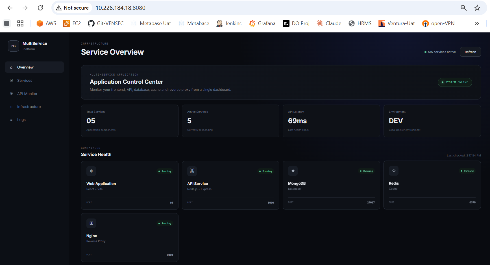
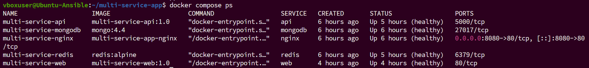
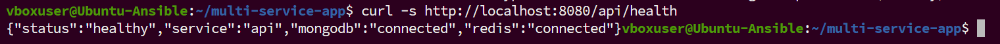

# Multi-Service Docker Application

A production-style multi-service web application built using **React, Node.js, Express, MongoDB, Redis, Nginx, Docker and Docker Compose**.

The main objective of this project is to demonstrate how multiple application components can be containerized, connected through a Docker network, secured using Docker Secrets, monitored using health checks, and managed as a complete application stack using Docker Compose.

---

## 1. Project Overview

This project implements a complete multi-service application where a React frontend communicates with a Node.js + Express backend through an Nginx reverse proxy.

The backend communicates with:

- MongoDB for persistent application data
- Redis for fast key-value/cache operations

All services run as Docker containers and communicate through a dedicated Docker bridge network.

### Application Flow

```text
                         User / Browser
                              |
                              v
                     +----------------+
                     |     Nginx      |
                     | Reverse Proxy  |
                     |    :8080       |
                     +-------+--------+
                             |
                 +-----------+-----------+
                 |                       |
                 v                       v
          +-------------+         +-------------+
          | React + Vite|         | Node.js API |
          |    Web      |         |   Express   |
          |    :80      |         |    :5000    |
          +-------------+         +------+------+
                                         |
                              +----------+----------+
                              |                     |
                              v                     v
                       +-------------+       +-------------+
                       |   MongoDB   |       |    Redis    |
                       |   :27017    |       |    :6379    |
                       +-------------+       +-------------+
```

---

## 2. Why This Project Was Created

The project was created to understand and implement a real-world containerized application architecture rather than running individual services manually.

The main goals were:

- Learn how to containerize frontend and backend applications
- Understand Docker multi-stage builds
- Create reusable custom Docker base images
- Connect multiple containers using Docker Compose
- Implement service-to-service communication
- Use Nginx as a reverse proxy
- Implement persistent storage
- Protect database credentials using Docker Secrets
- Add container health checks
- Configure container log rotation
- Test application failure and recovery behavior
- Reduce Docker build context using `.dockerignore`
- Validate the complete frontend-to-database request flow

This project demonstrates how a development environment can be structured similarly to a production-oriented microservice/container architecture.

---

## 3. Technologies Used

| Technology | Purpose |
|---|---|
| React | Frontend UI |
| Vite | Frontend build tool |
| Node.js | Backend runtime |
| Express.js | REST API |
| MongoDB | Persistent database |
| Redis | Cache / key-value store |
| Nginx | Reverse proxy and web server |
| Docker | Containerization |
| Docker Compose | Multi-container orchestration |
| Docker Secrets | Secure password management |
| Docker Volumes | Persistent storage |
| Docker Networks | Container communication |

---

## 4. Project Structure

```text
multi-service-app/
│
├── api/
│   ├── src/
│   │   └── server.js
│   ├── Dockerfile
│   ├── .dockerignore
│   ├── package.json
│   └── package-lock.json
│
├── web/
│   ├── src/
│   │   ├── main.jsx
│   │   └── style.css
│   ├── Dockerfile
│   ├── .dockerignore
│   ├── index.html
│   ├── package.json
│   ├── package-lock.json
│   └── vite.config.js
│
├── base-images/
│   ├── api-base/
│   │   └── Dockerfile
│   └── web-base/
│       └── Dockerfile
│
├── nginx/
│   ├── Dockerfile
│   └── nginx.conf
│
├── secrets/
│   └── mongo_password.txt
│
├── docker-compose.yml
├── .gitignore
└── README.md
```

The `secrets/` directory is intentionally excluded from Git tracking. Database passwords should never be committed to the repository.

---

## 5. Services

The application consists of five main services.

### 5.1 Web Application

The frontend is developed using React and Vite.

**Responsibilities:**

- Display the application dashboard
- Display service status
- Communicate with the backend API
- Show MongoDB and Redis connectivity
- Provide a simple interface for validating the complete application stack

The production frontend is served using Nginx.

**Container port:** `80`

### 5.2 API Service

The backend is implemented using Node.js and Express.

**Responsibilities:**

- Provide REST API endpoints
- Check MongoDB connectivity
- Check Redis connectivity
- Insert messages into MongoDB
- Store the latest message in Redis
- Return application health status

**Container port:** `5000`

### 5.3 MongoDB

MongoDB is used as the persistent database.

The project uses: `mongo:4.4`

MongoDB data is stored in a Docker named volume:

```text
multi-service-app_mongodb-data
```

This ensures that database data survives container restarts.

### 5.4 Redis

Redis is used as a fast key-value store/cache.

Redis runs with AOF persistence enabled:

```text
redis-server --appendonly yes
```

Redis data is stored in:

```text
multi-service-app_redis-data
```

### 5.5 Nginx

Nginx acts as the reverse proxy and single entry point for the application.

The browser communicates with:

```text
http://localhost:8080
```

Nginx routes:

```text
/       -> React frontend
/api/*  -> Express API
```

For example, `/api/health` is forwarded to `api:5000/health`.

This means the browser does not need to directly access the API container.

---

## 6. Docker Network

A dedicated Docker bridge network is created: `app-network`

All application services are connected to this network.

Because Docker Compose provides internal DNS resolution, services can communicate using service names.

For example:

```text
mongodb:27017
redis:6379
api:5000
web:80
```

The API therefore does not need hard-coded container IP addresses.

---

## 7. Custom Base Images

Reusable base images were created for the frontend and backend.

**Web Base Image:** `multi-service-web-base:1.0`

**API Base Image:** `multi-service-api-base:1.0`

Both are based on: `node:22-alpine`

The purpose of using custom base images is to:

- Standardize the Node.js environment
- Reduce duplication
- Reuse a common runtime/build environment
- Make Dockerfile maintenance easier

---

## 8. Multi-Stage Frontend Build

The frontend uses a multi-stage Docker build.

### Stage 1 - Builder

The builder stage:

- Uses the custom web base image
- Copies package files
- Installs dependencies
- Copies source code
- Builds the React application

```bash
npm ci --include=dev
npm run build
```

The Vite build generates: `dist/`

### Stage 2 - Production

The production stage uses: `nginx:alpine`

Only the generated dist files are copied into the final image.

This keeps development/build dependencies out of the production image.

---

## 9. API Docker Image Optimization

The API Dockerfile uses:

```bash
npm ci --omit=dev
```

This installs only production dependencies.

The API container runs as the non-root `node` user.

This improves container security by avoiding unnecessary root privileges.

---

## 10. Docker Secrets

The MongoDB password is not hard-coded into the Docker Compose configuration.

Instead, Docker Secrets are used.

**Secret file:** `secrets/mongo_password.txt`

The API reads the password from: `/run/secrets/mongo_password`

MongoDB also receives the password through the same secret.

This is safer than putting credentials directly inside:

- Dockerfiles
- source code
- docker-compose.yml
- GitHub repository

The secret file is excluded using `.gitignore`.

---

## 11. Persistent Storage

Two named Docker volumes are used.

**MongoDB:** `multi-service-app_mongodb-data`

**Redis:** `multi-service-app_redis-data`

Named volumes ensure that application data survives container recreation and restarts.

Persistence was tested by:

1. Writing data
2. Restarting containers
3. Checking the data again

The data remained available after restart.

---

## 12. Health Checks

Health checks were implemented for all application services.

**Web:** checks `http://127.0.0.1/`

**API:** checks `http://127.0.0.1:5000/health`

**MongoDB:** checks `db.adminCommand('ping')`

**Redis:** checks `redis-cli ping`

**Nginx:** checks `/nginx-health`

Docker Compose also uses health conditions so that dependent services start only after required services become healthy.

For example, the API waits for:

```text
MongoDB -> healthy
Redis    -> healthy
```

Nginx waits for:

```text
API -> healthy
Web -> healthy
```

---

## 13. Logging and Log Rotation

Docker's `json-file` logging driver is configured with log rotation.

Configuration:

```yaml
logging:
  driver: json-file
  options:
    max-size: "10m"
    max-file: "3"
```

This prevents unlimited container logs from consuming disk space.

Each container can therefore maintain up to approximately 10 MB × 3 files of rotated logs.

---

## 14. Docker Compose

All services are managed using one `docker-compose.yml`.

The complete stack can be started using:

```bash
docker compose up -d
```

The running services can be checked using:

```bash
docker compose ps
```

The stack can be stopped using:

```bash
docker compose down
```

Do not use `docker compose down -v` unless persistent data is intentionally being deleted.

---

## 15. Application Configuration

The API uses Docker service names instead of localhost.

**MongoDB:**

```text
MONGO_HOST=mongodb
MONGO_PORT=27017
```

**Redis:**

```text
REDIS_HOST=redis
REDIS_PORT=6379
```

This works because all containers are connected to the same Docker network.

---

## 16. API Endpoints

### Health Check

```text
GET /api/health
```

Expected response:

```json
{
  "status": "healthy",
  "service": "api",
  "mongodb": "connected",
  "redis": "connected"
}
```

### Message API

```text
POST /api/message
```

This endpoint:

- Stores the message in MongoDB
- Stores the latest message in Redis
- Applies Redis expiration

This endpoint was used to verify backend-to-database and backend-to-cache integration.

---

## 17. End-to-End Request Flow

A complete request travels through the following architecture:

```text
Browser
   |
   v
Nginx :8080
   |
   +------> React Frontend
   |
   +------> Express API :5000
                  |
                  +----> MongoDB :27017
                  |
                  +----> Redis :6379
```

The frontend calls `fetch("/api/health")`.

Nginx receives the request and forwards it to the API.

The API then checks MongoDB and Redis, and returns the health response to Nginx, which sends it back to the browser.

---

## 18. Build Process

The frontend build process is:

```text
React Source
     |
     v
Docker Build Context
     |
     v
Custom Node Base Image
     |
     v
npm ci --include=dev
     |
     v
npm run build
     |
     v
Vite dist/
     |
     v
nginx:alpine
     |
     v
Production Web Container
```

The API build process is:

```text
Node.js Source
     |
     v
Custom API Base Image
     |
     v
npm ci --omit=dev
     |
     v
Express Application
     |
     v
Non-root Node User
     |
     v
API Container
```

---

## 19. .dockerignore Optimization

A `.dockerignore` file was added to the frontend.

It excludes:

```text
node_modules
dist
.git
.gitignore
Dockerfile*
npm-debug.log*
```

This prevents unnecessary files from being sent to the Docker daemon during builds.

**Before optimization:** Build context was approximately 45 MB

**After optimization:** Build context was reduced to approximately 256 B

This significantly reduces unnecessary Docker build data transfer and improves build efficiency.

---

## 20. Troubleshooting During Development

Several issues were identified and resolved during implementation.

### Vite Not Found During Docker Build

Initial build failed with:

```text
sh: vite: not found
```

The custom web base image contained `NODE_ENV=production`.

Since Vite was a development dependency, it was not available during the build.

The builder was therefore changed from `npm ci` to `npm ci --include=dev`.

After this change, `npm run build` completed successfully.

### MongoDB Compatibility

MongoDB 8 was initially considered, but the development environment's CPU/VirtualBox configuration did not support the required AVX instruction set.

MongoDB 4.4 was therefore used for compatibility with the environment.

### Frontend Stale Build

During development, the browser was displaying an older frontend version.

The issue was traced to the Docker image/build configuration.

The Compose configuration was updated to explicitly build the web image:

```yaml
build:
  context: ./web
  dockerfile: Dockerfile
```

The image was rebuilt and the container recreated.

The updated frontend then displayed the correct 5/5 services active.

---

## 21. Verification and Testing

The final application was tested using multiple checks.

### Container Status

```bash
docker compose ps
```

All five services were confirmed healthy:

```text
multi-service-api       healthy
multi-service-mongodb   healthy
multi-service-redis     healthy
multi-service-web       healthy
multi-service-nginx     healthy
```

### Frontend Test

```bash
curl -I http://localhost:8080
```

Result: `HTTP/1.1 200 OK`

### API Test

```bash
curl -s http://localhost:8080/api/health
```

Result:

```json
{
  "status": "healthy",
  "service": "api",
  "mongodb": "connected",
  "redis": "connected"
}
```

This confirms:

```text
Browser/Client
      |
      v
Nginx
      |
      v
API
   /     \
  v       v
MongoDB  Redis
```

---

## 22. Persistence Testing

MongoDB and Redis persistence were tested using Docker volumes.

The test process was:

```text
Create data
    |
    v
Verify data
    |
    v
Restart containers
    |
    v
Verify data again
```

MongoDB data remained available after restart.

Redis data also remained available because AOF persistence and a Docker volume were configured.

---

## 23. Resource Cleanup

Unused Docker resources were reviewed after implementation.

Unused anonymous volumes were removed using:

```bash
docker volume prune
```

Unused build cache was removed using:

```bash
docker builder prune
```

The required application volumes were preserved:

```text
multi-service-app_mongodb-data
multi-service-app_redis-data
```

This cleanup reduced unnecessary disk usage without removing application data.

---

## 24. Useful Docker Commands

**Start application**
```bash
docker compose up -d
```

**Stop application**
```bash
docker compose down
```

**Check containers**
```bash
docker compose ps
```

**View logs**
```bash
docker compose logs
```

**View service logs**
```bash
docker compose logs api
docker compose logs nginx
docker compose logs mongodb
docker compose logs redis
docker compose logs web
```

**Rebuild a service**
```bash
docker compose build web
```

**Rebuild without cache**
```bash
docker compose build --no-cache web
```

**Check images**
```bash
docker images
```

**Check volumes**
```bash
docker volume ls
```

**Check Docker disk usage**
```bash
docker system df
```

---

## 25. Running the Project

### Prerequisites

Install:

- Docker
- Docker Compose

Verify:

```bash
docker --version
docker compose version
```

### Clone Repository

```bash
git clone <repository-url>
cd multi-service-app
```

### Create MongoDB Secret

Create the secret directory:

```bash
mkdir -p secrets
```

Create the password file:

```bash
echo 'YOUR_SECURE_PASSWORD' > secrets/mongo_password.txt
```

Secure the file:

```bash
chmod 600 secrets/mongo_password.txt
```

Never commit this file to GitHub.

### Start the Application

```bash
docker compose up -d
```

Check the services:

```bash
docker compose ps
```

Wait until all required services become healthy.

### Access the Application

Open: `http://localhost:8080`

API health: `http://localhost:8080/api/health`

---

## 26. Security Considerations

The project follows several basic container security practices:

- Database password is stored using Docker Secrets
- Secrets are excluded from Git
- API container runs as a non-root user
- Internal services communicate over a private Docker network
- Database and Redis ports are not directly published to the host
- Only Nginx exposes port 8080
- Production API dependencies are installed using `npm ci --omit=dev`

---

## 27. Screenshots

Screenshots can be added to this section after placing them inside the `screenshots/` directory.

- Application Dashboard
  
  
- Docker Services
  
  
- API Health
  
  
---

## 28. Final Architecture

```text
                         ┌─────────────────────┐
                         │       Browser       │
                         └──────────┬──────────┘
                                    │
                                    │ HTTP :8080
                                    ▼
                         ┌─────────────────────┐
                         │        Nginx        │
                         │   Reverse Proxy     │
                         └──────────┬──────────┘
                                    │
                     ┌──────────────┴──────────────┐
                     │                             │
                     ▼                             ▼
             ┌───────────────┐             ┌───────────────┐
             │ React + Vite  │             │ Node + Express│
             │     :80       │             │     :5000     │
             └───────────────┘             └───────┬───────┘
                                                   │
                                      ┌────────────┴────────────┐
                                      │                         │
                                      ▼                         ▼
                              ┌───────────────┐         ┌───────────────┐
                              │    MongoDB    │         │     Redis     │
                              │     :27017    │         │     :6379     │
                              │ Persistent DB │         │ Cache / Store │
                              └───────┬───────┘         └───────┬───────┘
                                      │                         │
                                      ▼                         ▼
                              Docker Volume              Docker Volume
```

All services communicate through: `app-network`

---

## 29. Key Learning Outcomes

Through this project, the following concepts were implemented practically:

- Docker containerization
- Docker Compose orchestration
- Multi-stage Docker builds
- Custom base images
- Docker networking
- Docker volumes
- Docker Secrets
- Nginx reverse proxy
- React production builds
- Node.js/Express API development
- MongoDB integration
- Redis integration
- Health checks
- Service dependencies
- Container logging
- Log rotation
- Docker image optimization
- Build-context optimization
- Application persistence
- End-to-end testing
- Container troubleshooting
- Resource cleanup
- Git and GitHub project management

---

## 30. Conclusion

This project demonstrates a complete containerized application stack where frontend, backend, database, cache, and reverse proxy services work together as a single application.

The final architecture provides:

- Modular services
- Persistent storage
- Secure credential handling
- Internal service networking
- Health monitoring
- Production-style frontend builds
- Reverse proxy routing
- Log rotation
- Optimized Docker build context
- End-to-end application validation

The project was successfully tested from:

```text
Frontend
   ↓
Nginx
   ↓
Express API
   ↓
MongoDB + Redis
```

with all five services running successfully and reporting healthy status.
